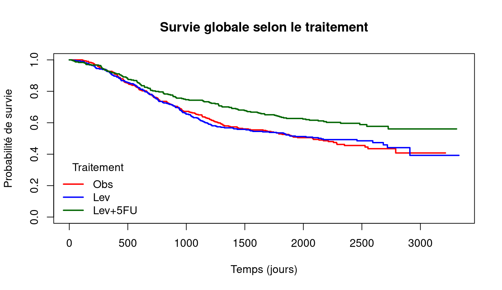

# Analyse de survie — Essai clinique cancer colorectal

## Objectif
Étudier l’association entre le traitement et la survie globale chez des patients atteints de cancer du côlon.
## Rapport interactif
[Voir ``
:::
](https://kami-koba.github.io/biostat-survival-colon/report_colon.html)
## Méthodologie
- Préparation des données (1 ligne par patient)
- Statistiques descriptives
- Courbes de Kaplan–Meier
- Test log-rank
- Modèle de Cox

## Résultat principal
Le traitement combiné **Levamisole + 5FU** est associé à une amélioration de la survie :

- Test log-rank : p ≈ 0.003
- Hazard Ratio : HR ≈ 0.69  
→ réduction d’environ 31% du risque de décès

## Courbe de survie

## Outils
R — survival, dplyr, RMarkdown

## Rapport complet
[Voir `report.html`
:::
](https://kami-koba.github.io/biostat-survival-colon/report_colon.html)
# biostat-survival-colon
